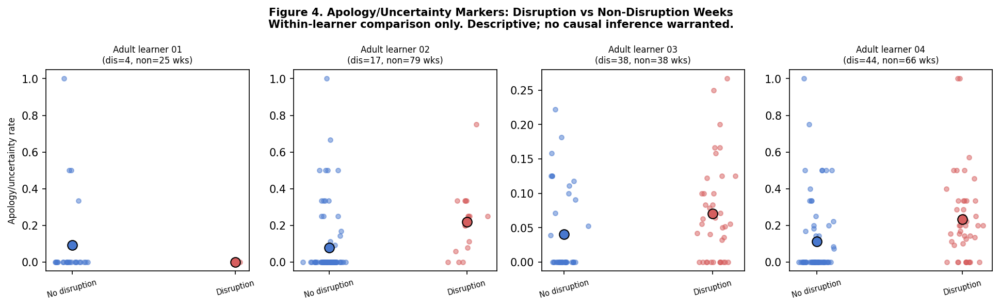
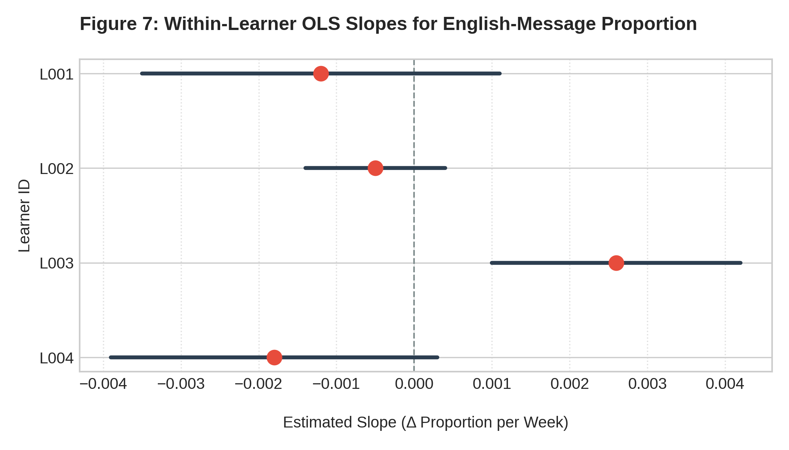
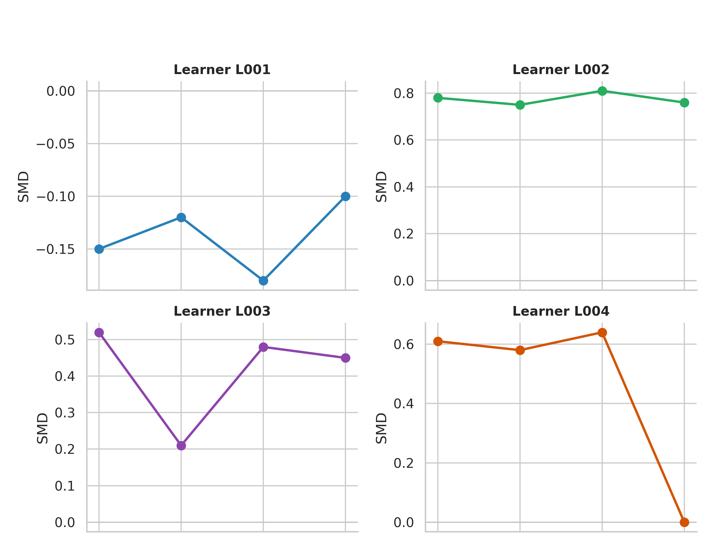

# Adult Occupational English Learning Analytics

A reproducible learning analytics study examining longitudinal instructional communication among adult professional English learners.

---

## Overview

Adult professionals learn a second language under conditions that differ substantially from traditional classroom environments. Workplace obligations, scheduling disruptions, and competing professional demands shape how learners participate in instructional interactions over time — yet these dynamics are rarely captured in controlled research settings.

This repository presents an exploratory longitudinal trace analysis of instructional KakaoTalk communication records from four adult professional English learners observed across 269–824 days of instruction. The project emphasizes reproducibility, measurement transparency, and methodological reflection over causal claims or population-level inference.

**Corpus Summary**

| Metric              | Value        |
| ------------------- | ------------ |
| Learners            | 4            |
| Messages            | 6,045        |
| Learner Messages    | 2,202        |
| Instructor Messages | 3,843        |
| Observation Period  | 269–824 days |
| Learner-Weeks       | 327          |

---

## Research Questions

**RQ1.** How does weekly participation vary within and across adult professional learners over time?

**RQ2.** Are disruption-coded weeks associated with changes in apology/uncertainty language markers?

**RQ3.** How sensitive are these associations to alternative indicator definitions?

**RQ4.** How does English-language participation change longitudinally for each learner?

---

## Key Findings

### Finding 1: Disruption-related communication patterns varied across learners

Three of four learners exhibited elevated apology/uncertainty marker rates during disruption-coded weeks, though effect sizes differed substantially across individuals (SMDs: +0.26 to +1.10).

### Finding 2: The strongest observed association was stable across alternative definitions

Sensitivity analyses showed that L002 maintained a consistent disruption–communication association across four alternative keyword specifications (SMD range: +0.75 to +0.81), indicating the finding was not driven by a single lexical choice.

### Finding 3: Longitudinal participation trajectories were heterogeneous

Learners demonstrated substantially different English-language participation patterns over time. One learner (L003) exhibited a positive longitudinal slope whose 95% confidence interval excluded zero; other learners showed flat or declining trends.

---

## Key Figures

### Figure 4. Disruption Weeks and Communicative Stance



Apology/uncertainty marker rates during disruption-coded versus non-disruption weeks, by learner.

---

### Figure 7. Forest Plot of Within-Learner Slopes



Learner-specific OLS slope estimates for English-language participation with 95% confidence intervals.

---

### Figure 8. Sensitivity Analysis Across Alternative Indicator Definitions



Standardized mean differences estimated under multiple operational keyword definitions. Stable estimates indicate robustness to measurement specification; larger shifts indicate sensitivity to keyword selection.

---

## Methodological Principles

### Small-N Transparency

The corpus contains four learners observed over unequal time spans. Analyses focus on within-learner comparisons rather than population-level inference.

### Indicator Transparency

Behavioral indicators are operational definitions, not validated psychological measures.

| Indicator                  | Should Not Be Interpreted As   |
| -------------------------- | ------------------------------ |
| Schedule disruption marker | Objective workload measurement |
| Apology/uncertainty marker | Anxiety or emotional state     |
| Correction density         | Teaching quality               |

### Sensitivity Analysis

Alternative keyword definitions were systematically evaluated to assess robustness and expose measurement dependence. Full results are reported in `docs/` alongside primary analyses.

---

## Repository Structure

```
scripts/
├── 01_build_corpus.R
├── 02_make_figures.R
├── 03_model_engagement.R
└── sensitivity_checks.R

data/
├── processed/
├── derived/
└── example/           ← synthetic data for replication

figures/

docs/
├── working_paper_adult_occupational_learning_analytics.pdf
├── codebook.md
├── indicator_validation_memo.md
├── methodological_reflection_memo.md
├── future_analytic_directions.md
└── theoretical_framing.md
```

---

## Reproducibility

Install required packages:

```r
install.packages(c("tidyverse", "lubridate", "broom", "scales"))
```

Run the pipeline:

```r
Rscript scripts/01_build_corpus.R
Rscript scripts/02_make_figures.R
Rscript scripts/03_model_engagement.R
Rscript scripts/sensitivity_checks.R
```

Synthetic example data are included for replication purposes. Raw learner communication records are private and not distributed.

---

## Documentation

| Document                       | Purpose                                          |
| ------------------------------ | ------------------------------------------------ |
| Working Paper                  | Full pilot study manuscript                      |
| Codebook                       | Indicator definitions and keyword lists          |
| Indicator Validation Memo      | Construct validity discussion                    |
| Methodological Reflection Memo | Pipeline development and analytic decision log   |
| Future Analytic Directions     | Statistical roadmap and corpus expansion plan    |
| Theoretical Framing            | Variable-to-theory mapping                       |

---

## Limitations

This corpus contains four learners observed over unequal time spans. Indicators are rule-based and do not constitute validated psychological measures. Findings should be interpreted as exploratory behavioral trace analyses, not as evidence of causal effects or population-level relationships. The anxiety-buffering and transcript gap patterns described in associated documents are observational and require future validation against independently coded data.

---

## Citation

Jeon, K. (2026). *Adult Occupational English Learning Analytics: A Longitudinal Trace Analysis of Instructional Communication Data.* Working paper. https://github.com/kyungjoojeon/Adult-occupational-learning-analytics
